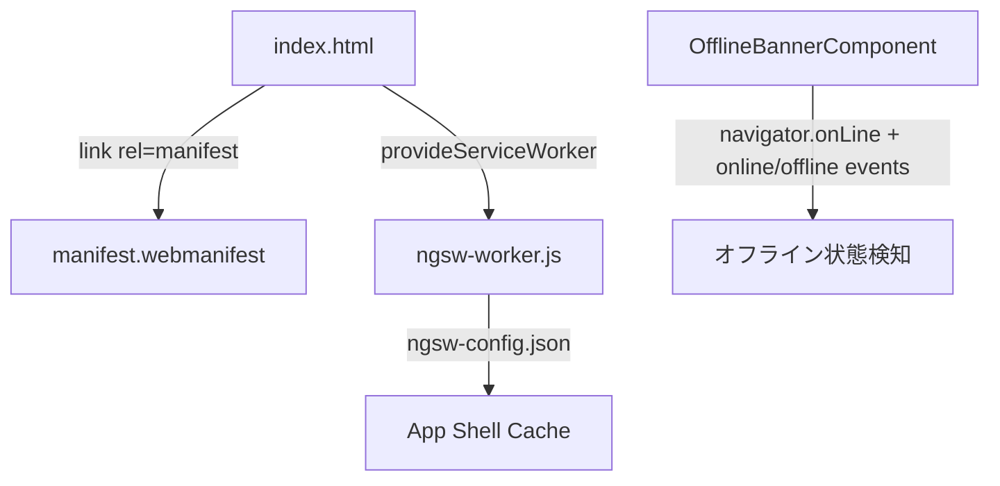

# 設計ドキュメント: PWA対応

## Overview

Angularの公式PWAサポート（`@angular/pwa`パッケージ）を活用し、最小限のカスタムコードでPWA化を実現する。`@angular/service-worker`が提供するService Worker管理・キャッシュ戦略・更新検知の仕組みをそのまま利用し、カスタム実装はオフライン通知バナーのみとする。

**設計判断の理由**: Angularが公式に提供するPWA基盤は、ngsw-config.jsonによる宣言的なキャッシュ設定、SwUpdateによる更新管理など、要件を十分にカバーする。独自Service Workerを書くよりも保守性・安定性が高いため、フレームワーク機能を最大限活用する方針とした。

## Architecture



**構成要素**:
- `manifest.webmanifest` — PWAメタデータ（アイコン、表示モード、色）
- `ngsw-config.json` — Service Workerキャッシュ戦略の宣言的設定
- `ngsw-worker.js` — Angularが生成するService Worker（ビルド時自動生成）
- `OfflineBannerComponent` — オフライン通知UI（唯一のカスタム実装）

## Components and Interfaces

### Service Worker登録（フレームワーク提供）

```typescript
// app.config.ts
import { provideServiceWorker } from '@angular/service-worker';

export const appConfig: ApplicationConfig = {
  providers: [
    provideServiceWorker('ngsw-worker.js', {
      enabled: !isDevMode(),
      registrationStrategy: 'registerWhenStable:30000',
    }),
  ],
};
```

**設計判断**: `registerWhenStable:30000`を採用。アプリ安定後に登録を試みるが、30秒経過しても安定しない場合は強制登録する。setIntervalなどで安定状態に到達しないケースへの対策。

### オフライン通知バナー

```typescript
@Component({
  selector: 'app-offline-banner',
  standalone: true,
  template: `
    @if (isOffline()) {
      <div class="offline-banner" role="alert">
        オフラインです。一部機能が制限されています。
      </div>
    }
  `,
})
export class OfflineBannerComponent {
  isOffline = signal(!navigator.onLine);

  constructor() {
    effect(() => {
      const handleOnline = () => {
        setTimeout(() => this.isOffline.set(false), 3000);
      };
      const handleOffline = () => this.isOffline.set(true);
      window.addEventListener('online', handleOnline);
      window.addEventListener('offline', handleOffline);
      return () => {
        window.removeEventListener('online', handleOnline);
        window.removeEventListener('offline', handleOffline);
      };
    });
  }
}
```

**設計判断**: Angular Signalsを使用。RxJSのObservableでも実装可能だが、単純な状態管理にはSignalsが簡潔。3秒遅延は要件4.2に基づく。

### HTTPエラーインターセプター（オフライン時）

```typescript
export const offlineInterceptor: HttpInterceptorFn = (req, next) => {
  return next(req).pipe(
    catchError((error) => {
      if (!navigator.onLine) {
        // オフライン時はユーザー入力を破棄せずエラーを通知
        return throwError(() => new OfflineError(req.url));
      }
      return throwError(() => error);
    }),
  );
};
```

## Data Models

本specではデータベースへの変更なし。Service Workerが管理するCache Storageのみ使用。

### ngsw-config.json（キャッシュ設定）

```json
{
  "index": "/index.html",
  "assetGroups": [
    { "name": "app-shell", "installMode": "prefetch",
      "resources": { "files": ["/favicon.ico", "/index.html", "/manifest.webmanifest", "/*.css", "/*.js"] } },
    { "name": "assets", "installMode": "lazy", "updateMode": "prefetch",
      "resources": { "files": ["/assets/**", "/*.(png|jpg|svg|ico)"] } }
  ]
}
```

**設計判断**: App Shellは`prefetch`（インストール時に全取得）、画像等は`lazy`（初回アクセス時にキャッシュ）。起動速度とストレージ効率のバランスを取った。Angular SWはassetGroup/dataGroupに一致しないナビゲーションリクエストに対してプリキャッシュ済みの`index.html`を返すため、別途`offline.html`を用意する必要はない。オフライン時のユーザー通知はアプリ内バナーで対応する。

### manifest.webmanifest

必須フィールド: `name`, `short_name`, `theme_color`, `background_color`, `display: "standalone"`, `scope: "/"`, `start_url: "/"`

アイコン構成:
- `assets/icons/icon-192x192.png` — 192x192, purpose: "any"（ホーム画面用）
- `assets/icons/icon-512x512.png` — 512x512, purpose: "any"（スプラッシュ画面用）
- `assets/icons/icon-512x512-maskable.png` — 512x512, purpose: "maskable"（適応型アイコン用）

## Error Handling

| シナリオ | 対応 |
|---------|------|
| SW登録失敗 | console.errorに記録、アプリは通常動作を継続 |
| SW非対応ブラウザ | `provideServiceWorker`のenabled条件で自動スキップ |
| App Shellキャッシュ失敗 | Angular SWがインストールを中断、次回アクセスで再試行 |
| オフライン時APIリクエスト | `OfflineError`をthrow、UIがエラーメッセージ表示＋入力データ保持 |
| SW更新検出 | 全タブ閉じ後の次回ロードで自動有効化（Angular SWデフォルト動作） |

## Testing Strategy

本featureは大部分がフレームワーク設定と静的ファイルであり、Property-Based Testingは適用しない。受け入れ基準の大半はmanifestフィールド検証やAngular SWのフレームワーク動作であり、入力空間が存在しないため。

- **ユニットテスト**: `OfflineBannerComponent`の表示切替・3秒遅延、`offlineInterceptor`のエラーハンドリング、manifest必須フィールド検証
- **統合テスト**: ビルド成果物（ngsw-worker.js、manifest、App Shell）の存在確認、Lighthouse PWA監査
